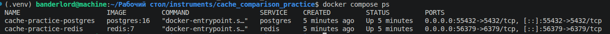
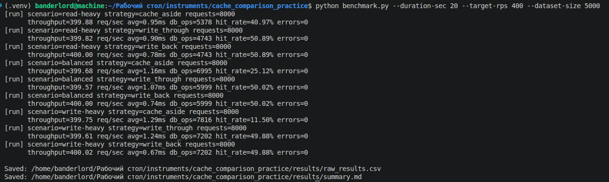

# Практика: Сравнение типов кеширования

## Что сделано

Реализована одна и та же система (`application + cache + DB + load-generator`) в 3 вариантах кеширования:

- `cache_aside` (Lazy Loading / Cache-Aside / Write-Around)
- `write_through`
- `write_back`

Для всех вариантов используется единый тест:

- одинаковый набор данных;
- одинаковое число запросов;
- одинаковая длительность;
- одинаковые сценарии нагрузки:
  - `read-heavy` (`80/20`)
  - `balanced` (`50/50`)
  - `write-heavy` (`20/80`)

## Структура папки

- `benchmark.py` - единый генератор нагрузки и сборщик метрик
- `app/cache_strategies.py` - логика 3 стратегий кеширования
- `docker-compose.yml` - `PostgreSQL` и `Redis`
- `init/01-schema.sql` - схема БД
- `requirements.txt` - Python-зависимости
- `results/raw_results.csv` - сырые результаты (автогенерируется)
- `results/summary.md` - итоговый отчет в Markdown (автогенерируется)
- `screenshots/` - скриншоты для сдачи

## Запуск

```bash
cd cache_comparison_practice
python3 -m venv .venv
source .venv/bin/activate
pip install -r requirements.txt

docker compose up -d
python benchmark.py --duration-sec 20 --target-rps 400 --dataset-size 5000
```

Остановка стенда:

```bash
docker compose down
```

По умолчанию используются порты:

- `PostgreSQL`: `55432`
- `Redis`: `56379`

## Какие метрики собираются

- `throughput` (`req/sec`)
- средняя задержка
- `p95` задержки
- количество обращений в БД (`db_reads`, `db_writes`, `db_total_ops`)
- `cache hit rate`
- ошибки

Дополнительно для `write_back`:

- `wb_queue_max` - максимальный размер очереди отложенных записей
- `wb_queue_avg` - средний размер очереди
- `wb_flushed_items` - сколько записей реально дошло до БД через флашер
- `wb_flush_batches` - сколько батчей флашера выполнено

## Итоговый отчет

После запуска заполняются:

- [`results/raw_results.csv`](results/raw_results.csv)
- [`results/summary.md`](results/summary.md)

`summary.md` уже содержит:

- таблицу по всем трем стратегиям и трем нагрузкам;
- отдельный блок по накоплению записей у `write_back`;
- авто-выводы по лучшей стратегии для `read-heavy`, `balanced`, `write-heavy`.

## Скриншоты для сдачи

1. 
2. 