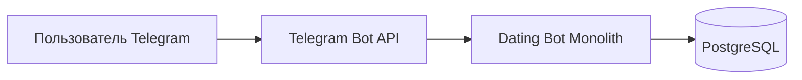
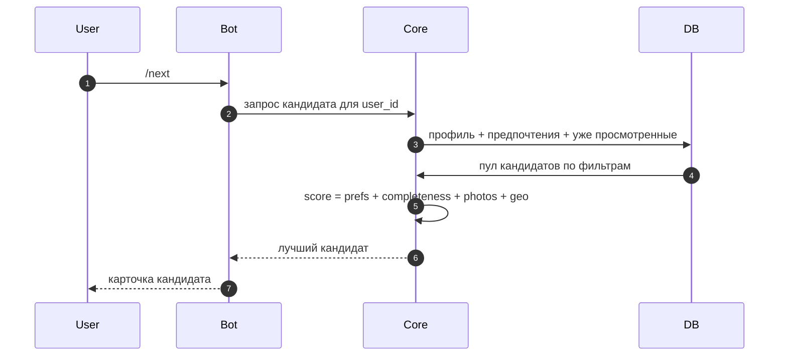

# 2. Архитектура и дизайн системы (упрощенно)

## 2.1 Подход для учебного проекта

Используем **один монолит**:
- Telegram Bot (входные события);
- Core-логика (анкета, предпочтения, подбор, лайки/матчи);
- PostgreSQL (все данные).

## 2.2 Контекстная схема

## 2.3 Сценарий "получить кандидата"

## 2.4 Черновая формула скоринга

`total_score = 0.50 * geo_score + 0.25 * preference_score + 0.15 * completeness_score + 0.10 * photo_score`

Где:
- `preference_score`: совпадение по полу/возрасту;
- `completeness_score`: полнота анкеты;
- `photo_score`: нормализованный балл по количеству фото;
- `geo_score`: близость по городу/координатам.
