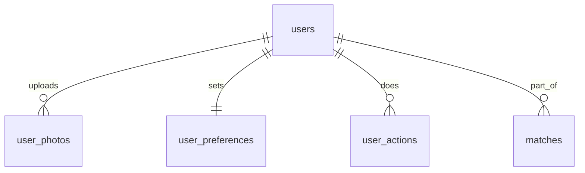

# 3. Схема данных БД (MVP)

Ниже актуальная модель PostgreSQL для обновленного набора таблиц.

## 3.1 Минимальные таблицы

1. `users` - пользователь Telegram + поля анкеты (возраст, пол, город, гео, полнота).
2. `user_photos` - фото пользователя.
3. `user_preferences` - первичные предпочтения.
4. `user_actions` - like/skip/block.
5. `matches` - взаимные лайки.

## 3.2 ER (упрощенно)

## 3.3 DDL (обновлено)

Актуальная версия также вынесена в `db/schema.sql`.

Примечание для Этапа 2:
- регистрация по `/start` требует только `telegram_id` и служебные поля;
- профильные поля (`birth_date`, `gender`, `city`) на этом этапе могут быть пустыми и заполняются позже.
