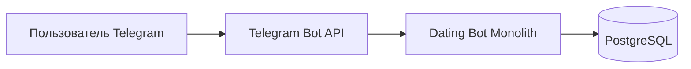
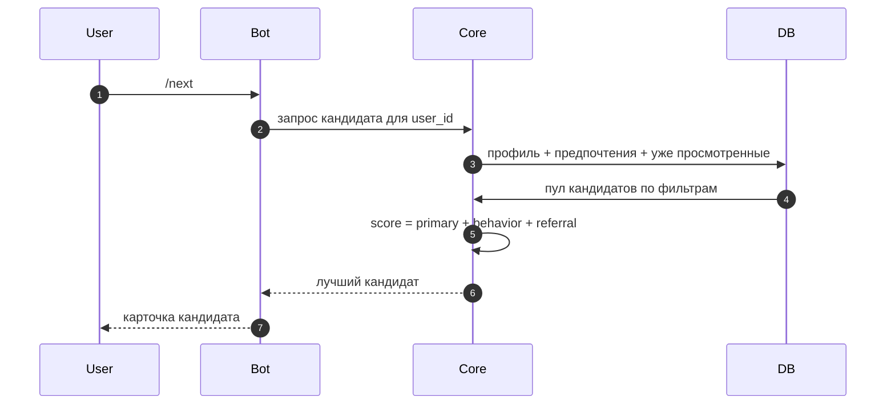

# 2. Архитектура и дизайн системы (упрощенно)

## 2.1 Подход для учебного проекта

Используем **один монолит**:
- Telegram Bot (входные события);
- Core-логика (анкета, предпочтения, подбор, лайки/матчи);
- PostgreSQL (все данные).

## 2.2 Контекстная схема

## 2.3 Сценарий "получить кандидата"

## 2.4 Формула скоринга Этапа 3

`total_score = 0.65 * primary_score + 0.30 * behavioral_score + 0.05 * referral_score`

Где:
- `primary_score`: возраст, пол, город, полнота анкеты и фото;
- `behavioral_score`: лайки, пропуски и мэтчи;
- `referral_score`: бонус за приглашенных пользователей.
