# Практика: аномалии изоляции в SQL

## 1. Что выбрано

Выбраны 4 аномалии:
1. Dirty Read
2. Non-Repeatable Read
3. Phantom Read
4. Lost Update

СУБД: **MySQL 8.0 (InnoDB)**.

## 2. Подготовка

1. Открыть 2 SQL-сессии (два окна клиента): `Session A` и `Session B`.
2. Выполнить скрипт инициализации:
   - `sql/00_init.sql`

## 3. Воспроизведение аномалий

### 3.1 Dirty Read

Файл: `sql/01_dirty_read.sql`

Шаги:
1. В `Session A` начать транзакцию на `READ UNCOMMITTED`, изменить баланс и **не** фиксировать.
2. В `Session B` на `READ UNCOMMITTED` прочитать ту же строку.
3. В `Session A` сделать `ROLLBACK`.

`Session A`:
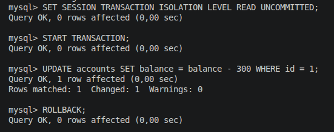

`Session B`:
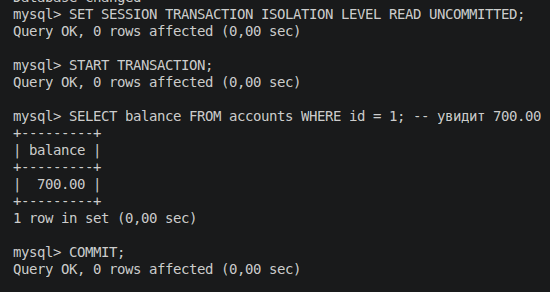

Результат:
- `Session B` увидит значение, которое позже откатывается.
- Это и есть грязное чтение.
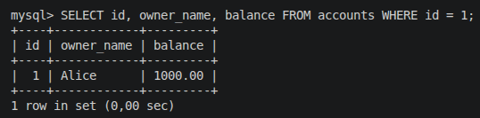

Как избежать:
- Использовать уровень изоляции не ниже `READ COMMITTED`.

---

### 3.2 Non-Repeatable Read

Файл: `sql/02_non_repeatable_read.sql`

Шаги:
1. В `Session A` (уровень `READ COMMITTED`) прочитать баланс.
2. В `Session B` обновить этот баланс и зафиксировать.
3. В `Session A` повторно прочитать ту же строку в рамках той же транзакции.

`Session A`:
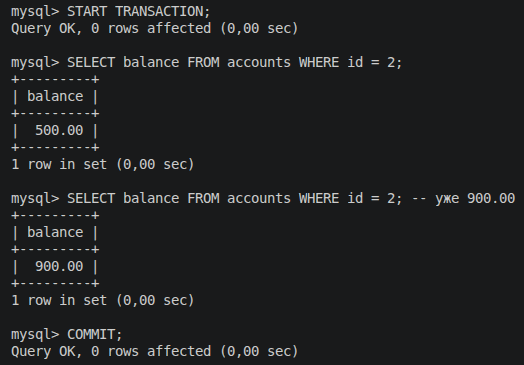

`Session B`:
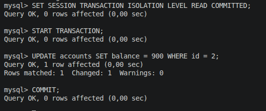

Результат:
- Повторный `SELECT` возвращает другое значение.
- Это неповторяющееся чтение.

Как избежать:
- Использовать `REPEATABLE READ` или `SERIALIZABLE`.

---

### 3.3 Phantom Read

Файл: `sql/03_phantom_read.sql`

Шаги:
1. В `Session A` (уровень `READ COMMITTED`) сделать `SELECT COUNT(*)` по условию.
2. В `Session B` вставить новую строку, подходящую под условие, и зафиксировать.
3. В `Session A` повторить тот же `SELECT COUNT(*)`.

`Session A`:
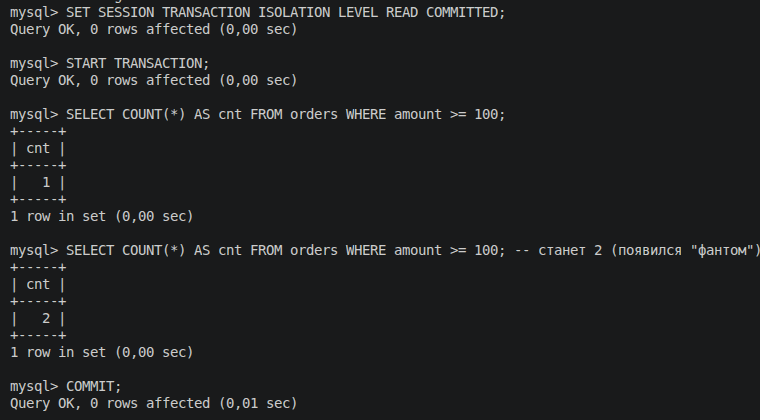

`Session B`:
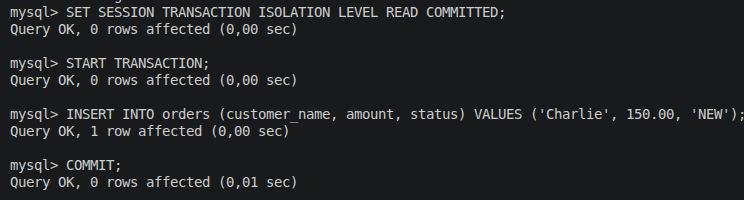

Результат:
- Количество строк меняется внутри одной транзакции.
- Это фантомное чтение.

Как избежать:
- Использовать `SERIALIZABLE`.
- Либо применять блокировки диапазона (`SELECT ... FOR UPDATE`) там, где это поддерживается логикой и СУБД.

---

### 3.4 Lost Update

Файл: `sql/04_lost_update.sql`

Шаги:
1. `Session A` и `Session B` читают один и тот же баланс (например, `1000`).
2. `Session B` считает новое значение и записывает `800`, затем `COMMIT`.
3. `Session A` на основе устаревшего чтения записывает `900`, затем `COMMIT`.

`Подготовка`:
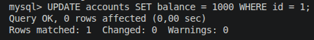

`Session A`:
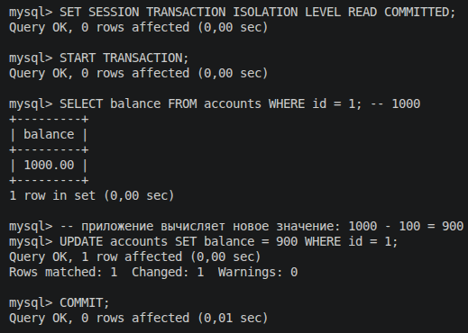

`Session B`:
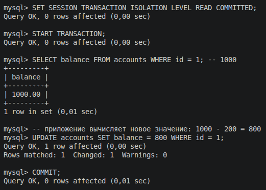

Результат:
- Итог `900` вместо ожидаемых `700`.
- Обновление `Session B` потеряно.
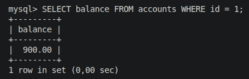

Как избежать:
- Пессимистическая блокировка: `SELECT ... FOR UPDATE`.
- Оптимистическая блокировка: версия строки (`version`) и проверка в `WHERE` при `UPDATE`.
- Атомарные обновления вида `UPDATE accounts SET balance = balance - ?`.

## 4. Структура файлов

- `sql/00_init.sql` — создание БД, таблиц, тестовых данных
- `sql/01_dirty_read.sql`
- `sql/02_non_repeatable_read.sql`
- `sql/03_phantom_read.sql`
- `sql/04_lost_update.sql`

